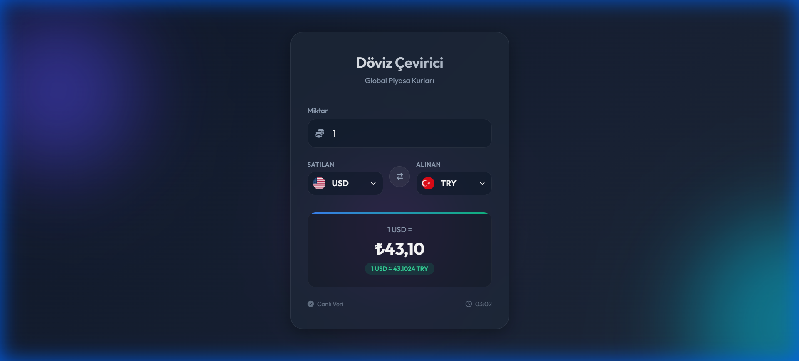

# Currency Converter Pro 🌍

[](https://mefedursun.github.io/doviz_hesaplama/)


**Canlı Demo:** [https://mefedursun.github.io/doviz_hesaplama/](https://mefedursun.github.io/doviz_hesaplama/)

Profesyonel, modern ve yüksek performanslı döviz çeviri uygulaması. Global finans piyasalarından anlık veri akışı sağlar ve "Dark Glassmorphism" arayüzü ile üst düzey bir kullanıcı deneyimi sunar.



## 🌟 Öne Çıkan Özellikler

- **💎 Premium UI/UX:** Koyu mod, cam efektleri (glassmorphism) ve akıcı animasyonlar.
- **⚡ Anlık Veri:** ExchangeRate-API entegrasyonu ile 160+ para birimi.
- **💾 Akıllı Hafıza:** Tarayıcı kapansa bile son seçtiğiniz para birimlerini hatırlar (LocalStorage).
- **📱 Mobile First:** iPhone ve Android cihazlarda native app hissi verir.
- **🚀 Performans:** Saf JavaScript (No-Framework) ile milisaniyelik açılış hızı.

## 🛠 Kurulum ve Geliştirme

Bu proje herhangi bir derleme (build) işlemi gerektirmez.

1.  **Clone:**
    ```bash
    git clone https://github.com/mefedursun/doviz_hesaplama.git
    cd doviz_hesaplama
    ```

2.  **Çalıştır:**
    Proje klasöründeki `index.html` dosyasını tarayıcınızda açmanız yeterlidir.
    
    > *İpucu: VS Code kullanıyorsanız "Live Server" eklentisi ile açmanızı öneririm.*

## 📂 Proje Yapısı

```
doviz_hesaplama/
├── index.html      # Semantik Ana Yapı
├── style.css       # Premium Theme & Responsive Kuralları
├── script.js       # API Logic, Caching & State Management
├── README.md       # Dokümantasyon
└── LICENSE         # MIT Lisans Dosyası
```

## 🤝 Katkıda Bulunma

1.  Fork'layın.
2.  Feature branch oluşturun (`git checkout -b feature/AmazingFeature`).
3.  Commit yapın (`git commit -m 'Add: AmazingFeature'`).
4.  Push'layın (`git push origin feature/AmazingFeature`).
5.  Pull Request açın.

## 📄 Lisans

Bu proje [MIT](LICENSE) lisansı altında dağıtılmaktadır.
